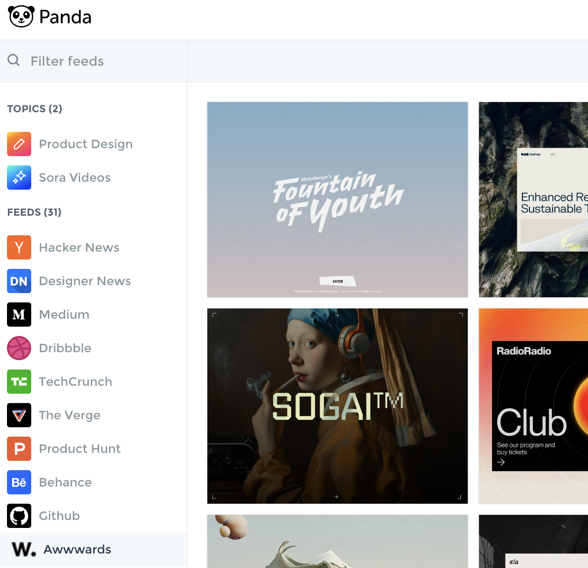
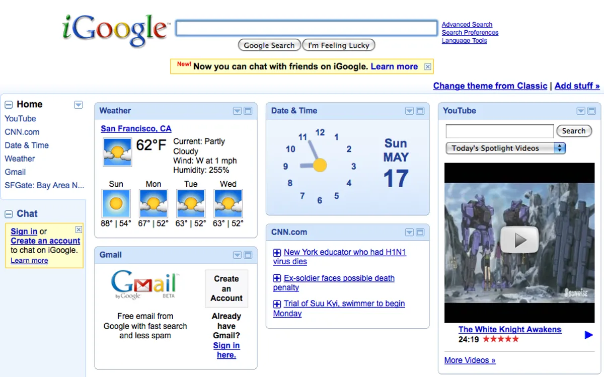
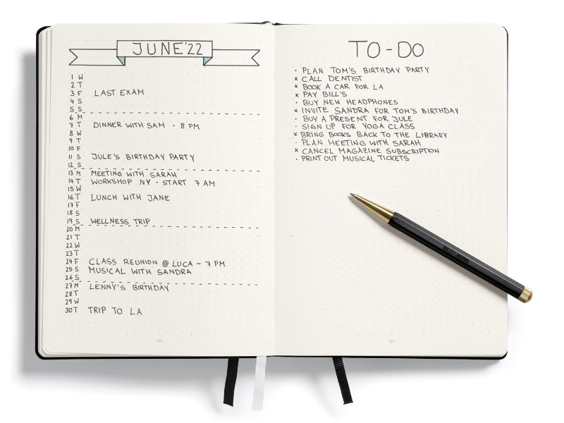

## The Problem

In our rapidly evolving technological landscape, the way we interact with technology hasn't kept pace. While young children effortlessly navigate phones and tablets, a significant portion of the population struggles with daily computer tasks. Important data is scattered across various apps and folders, isolated yet often interrelated. Navigating these interfaces to handle specific tasks can be time-consuming and frustrating.

## The Vision

Imagine a personal assistant that is aware of your tasks, daily activities, and relevant data, capable of acting on them. This assistant, always available and aware of the context you are in, keeps your data secure while functioning like a second brain—planning ahead and predicting your next steps.

The main goal of the project is to develop AI models that are aware of users' tasks, notes, goals, and plans, helping them achieve their goals through what I’m calling Goal-Oriented Human-Computer Interactions. Computers and devices, typically used to achieve goals, should assist users towards these goals by being aware of them and acting proactively on them, not just being passive to user input.

Moni combines a to-do list, task planner, habit tracker, news feed, communication platform, and file management into a single, seamless experience. It learns from your habits over time, providing better recommendations and advice. Dashboards and widgets display high-priority activities and context-specific information as soon as you interact with the system.

## Current Stage

From 2019 to 2021, I used bullet journaling to plan and track various aspects of my life on paper. In 2022, I transitioned to digital notes for better historical data tracking, habit monitoring, and planning. Discovering Obsidian in 2023 revolutionized my approach with markdown capabilities, customizable task views, calendar integration, and expense tracking and summary. I’m constantly expanding the capabilities of my note-taking system by automating budget calculations, and using graphs and charts for better expenditure visualization.

## Next Steps

The next steps involve enhancing even more the current tools I’m using by integrating them with local LLMs, keeping user information private, while suggesting actions based on goals gathered from user’s notes. Following this, I aim to integrate these LLMs with desktop interaction tools to handle tasks from user’s commands and the model’s suggestions.
